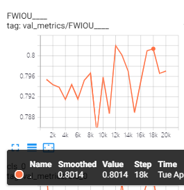

# Category Anchor Alignment 实验
这个是NIPS 19 的文章的复现代码，根据论文，我们可以看到利用该迁移网络，其最终在Cityscapes数据集上达到的效果如下。本篇所有运行的代码均为Category Anchor Alignment 仓库中代码。

## 1.直接运行部分调试后的源码
首先，我将pytorch版本变换之后出现的问题调整，并调用add files 版本的train.py进行训练:

各个损失均为波动减小的趋势：

训练到20个epoch左右，mIOU指标达到了49.3，同期FWIOU=80.14, PA=87.55 相较于我们的最好结果（mIOU=44.2，FWIOU=80.3,PA=88.6），该结果主要在mIOU上提升较多，但是其他指标，我们其实更有优势。实验指标变化如下：

总结：
1. 目前复现结果良好，初步符合预期，mIOU还相差0.9的指标，但训练过程还有进步空间，整体还有较大波动。
2. 该代码结构较混乱，核心逻辑整理需要费一些时间，目前还在努力整理中

## 2. 第一次重构：
运行Category alignment 的 finish reorgnization <revision number e602ab9f48cf44569190f76568152b657d34a1fe> 即可

复现结果在stage1可以达到49.7，重构后效果尚可

## 3.进一步重构后复现的效果
后来为了更好地添加功能，为现有代码进一步重构，训练过程直接修改成类，方便属性调用，为了验证重构地正确性，现在进一步复现代码。
运行 runnable version class_reorg_train_bs4_validate_each_epoch 版本号<65b68a18e913ebd90fe53aa601196da9fcf43fe9 2020/4/30 15:50>

再次重构之后，最高mIOU 为49.3 和之前的49.7 有一点差距，但是这个差距应该基本可以说是重构后代码没有问题了。

## 4. 加入风格迁移，探究其coarse feature alignment 的效果
通过将图片在一个batch内拆分，成功实现风格迁移bs=4的训练方式，并通过测试风格迁移的输出结果，明确其输出的标签和图片均已正确，训练结果如下。
申请5个GPU并训练<7dbe3bb2b0f50ac55a121f88f164580b8d79a882，2020/5/8 17:52>版本的代码。

这个版本的输出结果相较复现论文的结果有较大差距。实验步骤如下：

首先将图片进行风格迁移，随后传入之前 基于对抗方法促使网络分不清源域和目标域图片 预训练的网络，并将该网络输出的特征对齐到之前预置的anchor。

这一过程没有帮助分割网络更好地判断特征的类别，这一点主要是因为风格迁移后的图片已经和之前的特征有了较大的偏移，再将特征对齐到之前的特征对于特征的识别是没有益处的，这里应当将风格迁移模块融合到计算anchor的代码中。

如果基于风格迁移已经有了特征对齐的作用，那么促使分割网络输出的特征进一步逼近之前训练的anchor会促使类内的特征对齐，特征对齐之后，基于源域的特征就能对目标域很好地进行分割

## 5. multi-stage 的训练结果
论文中采用了一种multi-stage的方法提升其训练准确率，可以发现多个stage的mIOU逐渐提升，因此我也将第一次训练的模型加载到cac.py中并生成第二个stage需要的anchor，并进一步进行multi-stage 的训练，运行版本<>, 训练结果如下:

可以发现，相较于baseline，第二个stage的训练结果并没有超过第一个stage，不知道是不是应该再第二个stage修改一些参数。至少没有获得作者提到的mIOU大幅提升的结果。（虽然第一个stage的结果就已经比作者论文中第二个stage的结果还要好了，也可能是优化的进步空间不是很多了）

## ps: 设置bs=1和model.eval确定其影响
将没有风格迁移的代码设置为 bs=1和model.eval，明确其影响效果，由下图可以看出其明显影响了模型的收敛速度和表现性能。同时各类训练损失虽然因为bs的减小变少，但是validation loss 可以看出其在验证集上的效果不佳。版本号

