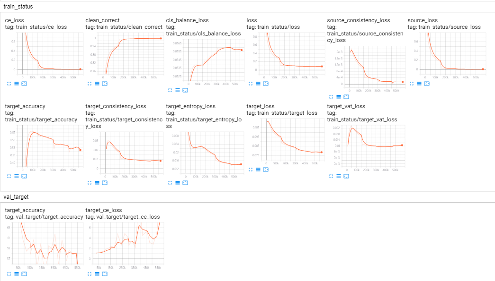

# Drop to adapt 实验
这个作者的代码还是很稳定的，基本上不需要怎么修改就运行起来了。

进入/data/Projects/DTA.pytorch，运行：
rlaunch --gpu=4 --cpu=30 --memory=20000 -- python3 main.py --config_path ./configs/resnet50_dta_vat.json --batch_size 16

结果：
Epoch 4, loss 0.087, ce_loss 0.008, target_loss 0.079, accuracy 99.785

基于每个epoch有9525个iteration，我们有以下一些数值的曲线图：

可以发现，训练很容易就过拟合了，过拟合之后validation的损失上升，精度也随之下降，因此这个网络还需要进一步调参来防止过拟合。

另外，虽然网络跑起来了，但是代码还需要好好琢磨一下