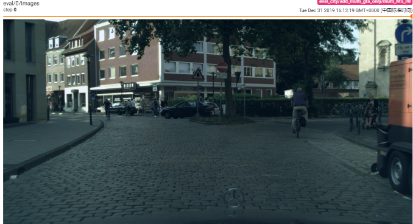
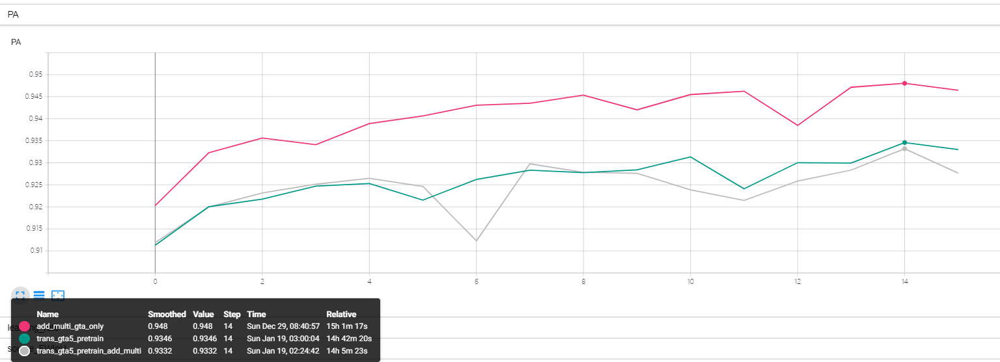
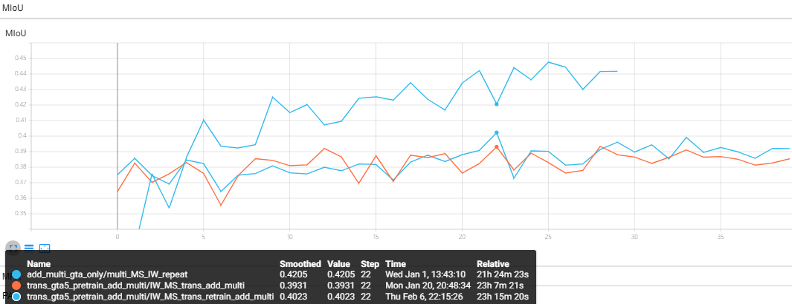

# Maxsquare loss 实验
 
1. [复现原论文](#复现原论文)
    * 在GTA5数据集上进行语义分割任务，作为预训练模型
    * 联合GTA5+Cityscapes数据集进行跨域实验，验证跨域结果
    * Cityscapes测试集上可视化结果
    * 附加实验target_solo

2. 风格迁移数据集上的实验
    * 基于GTA5_ambulance做语义分割实验，确定风格变化后的图像的具有可判别性特征
    * 基于GTA5_ambulance+Cityscapes_ambulance_newsize做跨域实验，进行特征对齐
    * Cityscapes_ambulance_newsize测试集上的可视化效果
    * 基于GTA5_ambulance_retrain的数据做跨域实验
    * 使用不同参数重新训练风格迁移网络，获得更好的数据用于训练跨域网络
    * 有辅助域和没有辅助域的实验对比
    * 将风格迁移网络和分割网络拉通训练，采取第一部分训练出的预训练模型

3. 替换backbone 为deeplabv3+
    * 将网络改为deeplabv3在风格迁移的数据上进行预训练
    * 将第一步的预训练网络进行加载并进行跨域训练

## 复现原论文
将原作者的github fork之后进行一些路径的修改，并进行了一系列实验。
### 在GTA5数据集上进行语义分割任务，作为预训练模型
首先在gta5数据集上使用deeplabv2进行训练以获得deeplabv2的预训练模型用于跨域实验

训练过程Miou变化：

在测试集上测试结果：

其中红色实线代表有multi输出设定的网络，即基于分割网络中间层特征结合ASPP进行输出层的预测。这个预训练的网络将给后续有multi设定的网络作为预训练网络使用。蓝色实线则是普通分割网络在gta数据集上的训练。最后二者都达到了0.71左右的MIOU分割结果，说明deeplabv2对于分割已经很厉害了。

#### GTA5在deeplabv2上训练结果总结：

1. 训练集上最高mIOU精度为0.77，测试集上最好为0.71

2. 增加浅层数据结果对齐后（multi），训练集上精度差异不大，测试集上有1个点左右的提升

### 使用gta5+cityscape数据集进行训练，基于不同的损失函数的训练结果
不同实验的名称和颜色，MS,IW_MS,multi_MS_IW分别代表不同损失函数，repeat代表相同设定下的重复实验。

图：实验名称展示和颜色对应说明

#### 训练损失变化：
损失函数整体下降，重复实验的损失整体没有之前的损失下降的多。

图：训练损失变化

#### 目标域的Miou变化: 
实验结果在不同训练下发生变换，最好结果为multi_MS_IW_repeat(mIOU= 44.7), 精度为MS<IW_MS<multi_MS_IW。

图：目标域（Cityscapes上）的mIOU精度变化

#### 源域IOU的变化:
有一定下降，同样的损失设定训练结果变化很大。

图：源域上不同实验下的mIOU的变化

#### 总结：

1）实验结果会随着实验次数有一定的波动

2）不同损失函数训练下，目标域的训练结果不同，其中最好结果为multi_MS_IW_repeat(mIOU= 44.7), 精度为MS<IW_MS<multi_MS_IW

3）源域测试集上mIOU在跨域实验后会有一定下降，最好结果为0.63左右

### 可视化结果在cityscape500张val图上输出结果
MS+IW+Multi 目前最好结果，19类整体像素精度87.4，mIOU44.8

图：cityscapes测试集上原图和预测图和标签图测试效果

图：MS+IW+Multi 上最好结果（橘色曲线最高点的测试结果）

### 附加实验
在训练一定epoch之后仅仅对目标域的数据集训练，进一步针对目标域进行对齐，这里想的是：由于目标域和源域特征可能还是没有完全对齐，因此，为了避免分类器穿过目标域特征中心，进一步仅仅对目标域进行分类边界的调整。

python3 tools/solve_gta5.py --exp IW_MS_target_solo_1_15 --restore_id add_multi --checkpoint_dir "./log/train/add_multi_gta_only" --save_dir "./log/train/add_multi_gta_only/multi_MS_IW_target_solo_1_15" --target_solo_epoch 20 --round_num 20 --target_mode "IW_maxsquare" --lambda_target 0.09 --multi True

【蓝色实线】：在GTA5数据集上使用multi+IW+MS的训练结果

【粉色实线】：在GTA5数据集上使用multi+IW+MS，并在第19个epoch开始单独训练目标域的结果

图：复现baseline和在第19个epoch后仅仅训练目标域数据两个实验的mIOU结果对比

图：复现baseline和在第19个epoch后仅仅训练目标域数据两个实验的目标损失结果对比

图：复现baseline和在第19个epoch后仅仅训练目标域数据两个实验的测试像素精度对比

总结：仅仅对目标域训练能减小目标损失（即减小目标域的不确定性），但是根据指标看出，少量的目标域上单独训练能提高像素精度，进一步降低目标损失，但是不能提高mIOU。从最后阶段可视化图可以看出，没有了源域图片的监督，目标域上训练的预测结果边缘更加模糊，并且有更多的大片错误分类。

图：测试图和标签

图：targetsolo的表现（上），对比的baseline的表现（下）

## 在风格迁移后的数据集上进行训练
### 基于GTA5_ambulance做语义分割实验，确定风格变化后的图像的具有可判别性特征
首先在风格变换后的GTA5数据集上利用deeplabv2网络做训练，获得用于后期再GTA5_ambulance和Cityscapes_ambulance_newsize上训练的deeplabv2网络的预训练模型，训练代码和结果如下：

【实验一，灰色实线】 

在MSL的fix_trans版本的trainsource代码训练，运行：
python3 tools/train_source.py --gpu "0" --dataset 'GTA5_ambulance' --save_dir "./log/train/trans_gta5_pretrain_add_multi/" --iter_max 200000 --iter_stop 80000 --freeze_bn False --weight_decay 5e-4 --lr 2.5e-4 --crop_size "1280,720" --multi True

【实验二，绿色实线】

在MSL的fix_trans版本的trainsource代码训练，运行：

python3 tools/train_source.py --gpu "0" --dataset 'GTA5_ambulance' --save_dir "./log/train/trans_gta5_pretrain/" --iter_max 200000 --iter_stop 80000 --freeze_bn False --weight_decay 5e-4 --lr 2.5e-4 --crop_size "1280,720"

图：三组实验的像素精度对比

图：三组实验的平均交并比（mIOU）对比

图：三组实验的训练损失对比

GTA5_TRANS实验训练结果总结：
1） 总体说来，在GTA5_ambulance上的训练，损失得到收敛，像素精度（93.4%）和mIOU（0.65）达到较好结果。
2）但是，在GTA5_trans上的训练结果不如在GTA5上训练的结果，整体像素精度降低1.5%，mIOU降低0.06
3）因此，在GTA5_trans上能提取有辨识度的信息，并且可以良好地用于分割结果，但是由于边缘有一定模糊等因素，导致分割精度有1%的降低，mIOU有0.05的降低

### 基于GTA5_ambulance+Cityscapes_ambulance_newsize做跨域实验，进行特征对齐
【实验一，橘色实线】

在MSL的fix_trans版本的train_trans_only.py 代码训练，运行：

python3 tools/train_trans_only.py --exp IW_MS_trans_add_multi --restore_id test --checkpoint_dir "./log/train/trans_gta5_pretrain_add_multi/" --save_dir "./log/train/trans_gta5_pretrain_add_multi/IW_MS_trans_add_multi/"  --round_num 20 --target_mode "IW_maxsquare" --lambda_target 0.09 --multi True

 

【实验二，蓝色实线】

在MSL的fix_trans版本的train_trans_only.py 代码训练，运行：

python3 tools/train_trans_only.py --exp IW_MS_trans --restore_id test --checkpoint_dir "./log/train/trans_gta5_pretrain/" --save_dir "./log/train/trans_gta5_pretrain_add_multi/IW_MS_trans /"  --round_num 20 --target_mode "IW_maxsquare" --lambda_target 0.09

图：两个实验中在目标数据集的验证集上测试的mIOU（上）和FwIOU（下）变化，和原文复现结果对比

图：两个实验的在目标数据集的验证集上的像素精度变化，和原文复现结果对比

图：训练损失，修改数据集之后，训练损失（源域上的分割损失）下降不如原来的快，可能是之前提到的数据原因导致分割准确度的下降

图：目标损失的变化，修改数据集之后，训练损失也不如之前实验下降地快，但是后期可以下降到更低水平

结果分析：
1. 两个实验在目标数据集上测试的结果和预期结果有一定差距，其中这两个实验的mIOU和复现实验mIOU的差距较大，但是PA（像素精度）相差无几；说明从图片整体像素个数说来，新的方法和原来方法效果相近，但是由于个别像素较少的小类别的表现不佳，因此平均下来也就有了差距，而从fwIOU的表现来看，数据变化前后的fwIOU基本持平
2. 网络损失在新的实验中不断下降，和原复现实验的损失相差不多，但是损失的变化和最终衡量指标的变化有不一致的情况。在实验中，train_loss（在源域数据上预测结果的交叉熵损失）和target_loss（目标域数据集上预测结果和标签的IW+Maxsqare损失）不断下降，但是指标的变化却是不断波动，因此也许可以适当地改进损失，来进一步确保实验指标和损失的一致性，从而保证优化网络的同时优化了最终的训练指标。
3. 特征对齐的部分还没有完全达到要求；如果GTA5和Cityscapes的数据特征已经对齐，即便在分割网络处，可能因为数据集迁移的原因导致分割精度的下降；但是在目标域上预测时，由于已经有了大量相同特征的数据（GTA5_ambulance数据）训练，因此目标域（Cityscapes_ambulance）上输出应当较为确定，即目标损失较小。但是，从目标损失的变化曲线看来，目标损失仅仅在前两个epoch比对比实验的损失小，后续由于损失下降较慢，对比实验的损失马上就小于了本实验的损失。因此，需要进一步对特征对齐进行优化。

### Cityscapes_ambulance_newsize测试集上的可视化效果
原图|标签|结果
----|----|----
 | |  在无风格迁移数据上进行域适应的结果（第29个epoch）
| | 在有风格迁移数据上进行域适应的结果（第39个epoch）

###  基于GTA5_ambulance_retrain进行跨域实验
观察改变风格迁移网络是否对最后分割结果有提升效果，我将风格迁移网络利用GTA5重新训练，保存训练后的权重，并利用这个权重的网络得到了GTA5_retrain，相当于此时风格迁移网络改变了权重，此时重新训练后得到如下结果。

【实验一，蓝色实线】

在MSL的start add ADAIN training版本的train_trans_only.py 代码训练，运行：

python3 tools/train_trans_only.py --exp IW_MS_trans_retrain --restore_id test --checkpoint_dir "./log/train/trans_gta5_pretrain_add_multi/" --save_dir "/data/Projects/MaxSquareLoss/log/train/trans_gta5_pretrain_add_multi/IW_MS_trans_retrain"  --round_num 20 --target_mode "IW_maxsquare" --lambda_target 0.09 --multi True

IW_MS_trans_retrain：重新训练风格迁移后的实验结果

IW_MS_trans_add_multi：使用标准权重的风格迁移网络进行跨域实验的结果

multi_MS_IW_repeat：原论文的实验结果

图：重新训练分割迁移网络前后的fwIOU的变化，可以看出指标明显增加，最高78.7，同时高于原论文的复现实验（77.4）

图：重新训练分割迁移网络前后的mIOU的变化，可以看出指标明显增加，最高达到40.23，但是还是低于原论文的结果44.7

图：重新训练分割迁移网络前后的像素精度的变化，最高达到87.6%，高于原论文的结果87%

总结：

针对GTA5数据集重新训练风格迁移网络后，再进行跨域实验，像素精度和fwIOU均明显提高，并且高于复现论文的最好结果，但是mIOU没有达到原有精度。因此调整风格迁移网络确实可以提升整体精度。

### 修改风格迁移网络参数之后进行跨域网络的训练
因为本次的创新点主要集中于风格迁移网络的进行特征对齐，同时上次经过重新训练的风格迁移网络的输出结果要好于没有进行重新训练的，因此，这一阶段将风格迁移网络采用不同的参数进行重新训练，根据风格迁移网络参数+对应的跨域实验效果，观察能更好用于跨域实验的图片表现，并在此基础上生成更加适合跨域网络的迁移图片。

【实验1】绿色实线

在 add more adain params 版本的train_trans_only 上进行训练， alpha=1，style_wts = 1 使用 GTA5+Cityscape数据训练风格迁移网络

python3 tools/train_trans_only.py --exp IW_MS_trans_gta5pcity_retrain_alpha1wts1_add_multi --restore_id test --checkpoint_dir "./log/train/trans_gta5_pretrain_add_multi/" --save_dir "/data/Projects/MaxSquareLoss/log/train/trans_gta5_pretrain_add_multi/IW_MS_trans_gta5pcity_retrain_alpha1wts1_add_multi"  --round_num 20 --target_mode "IW_maxsquare" --lambda_target 0.09 --multi True

【实验 2】玫红色实线

在 add more adain params 版本的train_trans_only 上进行训练， alpha=1，style_wts = 5，使用 GTA5+Cityscape数据训练风格迁移网络，训练好的网络生成数据用于跨域实验。

python3 tools/train_trans_only.py --exp IW_MS_trans_retrain_alpha1wts5_add_multi --restore_id test --checkpoint_dir "./log/train/trans_gta5_pretrain_add_multi/" --save_dir "/data/Projects/MaxSquareLoss/log/train/trans_gta5_pretrain_add_multi/IW_MS_trans_retrain_alpha1wts5_add_multi"  --round_num 20 --target_mode "IW_maxsquare" --lambda_target 0.09 --multi True

总结：

1）通过重新使用不同参数训练风格迁移神经网络，mIOU，fwIOU等指标均有一定提升

2）目前实验mIOU 和复现论文仍有差距（-1.5），但是在PA（+1.38）和fwIOU（+2.6） 上均有提升

### 使用辅助域和不使用辅助域效果对比
采用cityscapes数据集对GTA5数据集进行风格迁移，迁移的数据集GTA5_cityscapes 和Cityscapes数据集一起参与到跨域实验的训练中，最终结果如下：

实验名称 | mIOU | fwIOU | PA | target_loss | train_loss
-------- |-------|------|---------|---------|---------- 
复现论文的最好结果 | 44.7	 | 77.8 |	87.12 | -5.6e-3 | 	0.12
实验一（GTA5+Cityscapes：alpha=1，style_wts = 1 ）| 43.7（-1）|	80.98（+3.19）|	89.0（+1.88）|	-6.15e-3|	0.102
不使用辅助域的实验（alpha=1，style_wts = 1）（相对于复现论文）|	43.0（-1.7）|	78.9（+1.1）|	87.6（+0.48）|	-5.96e-3|	0.12

### 将风格迁移网络和分割网络拉通训练，采取第一部分训练出的预训练模型

这次改写代码之后出现了一个很重要的问题，在风格迁移网络部分的输出和期望输出差异很大，在调试过程中在不断对比网络结构，输入输出的差异，结果发现是图片保存数值溢出的问题，主要就是在图片保存时没有去除图片超出255/1的数值，还有就是在特征合并时一开始也没有按照比例相加而是直接相加，导致图片像素值溢出，但是图片保存时没有报错，最后保存的图片就很难看，因此保存图片不好看时第一步就应该马上检查保存图片的过程是否注意数值溢出的问题。
调试是通过完全固定变量法检查出来的，检查过程中还出现了pytorch浮点数比较的问题，pytorch实际每个tensor数值会有八位小数，但是通过print展示时只会保留四位小数，所以会出现看起来相等但是通过“==”比较不相等的问题，这种问题应该是时刻注意的。
【实验一，橘色实线】

将网络拉通之后，在预训练模型的基础上，进一步联合训练，其中风格迁移网络采用在别人预训练的VGG,DECODER模型，分割网络采用第一部分在GTA5_ambulance上预训练的deeplabv2模型

在MSL的fix_trans版本的ADAIN.py 代码训练，运行：

python3 tools/ADAIN.py --exp IW_MS_UNION_synctrn_add_multi --restore_id test --checkpoint_dir "./log/train/trans_gta5_pretrain_add_multi/" --save_dir "./log/train/trans_gta5_pretrain_add_multi/IW_MS_UNION_synctrn_add_multi/"  --round_num 20 --target_mode "IW_maxsquare" --lambda_target 0.09 --multi True

【实验二，蓝色实线】

在MSL的fix_trans版本的train_trans_only.py 代码训练，运行：

python3 tools/ADAIN.py --exp IW_MS_Usync_ada10back_retrain_add_multi --restore_id test --checkpoint_dir "./log/train/trans_gta5_pretrain_add_multi/" --save_dir "/data/Projects/MaxSquareLoss/log/train/trans_gta5_pretrain_add_multi/IW_MS_Usync_ada10back_retrain_add_multi/"  --round_num 20 --target_mode "IW_maxsquare" --lambda_target 0.09 --multi True

【实验三】

sudo python3 tools/ADAIN.py --exp IW_MS_Usync_stdDec_add_multi --restore_id test --checkpoint_dir "./log/train/trans_gta5_pretrain_add_multi/" --save_dir "/data/Projects/MaxSquareLoss/log/train/trans_gta5_pretrain_add_multi/IW_MS_Usync_stdDec_add_multi/"  --round_num 20 --target_mode "IW_maxsquare" --lambda_target 0.09 --multi True

【实验四】

python3 tools/ADAIN.py --exp IW_MS_Usync_adaback_retrain_add_multi --restore_id test --checkpoint_dir "./log/train/trans_gta5_pretrain_add_multi/" --save_dir "/data/Projects/MaxSquareLoss/log/train/trans_gta5_pretrain_add_multi/IW_MS_Usync_adaback_retrain_add_multi/"  --round_num 20 --target_mode "IW_maxsquare" --lambda_target 0.09 --multi True

## 替换backbone 为deeplabv3+
将网络改为deeplabv3在风格迁移的数据上进行预训练
修改网络backbone并保存到 deeplabv3+ 版本下运行train_source
【实验 gta5pcity_alpha1wts1_deeplabv3p_lr1e-3】灰色实线
python3 tools/train_source.py --dataset GTA5_ambulance_gta5pcity_retrain_alpha1stylewt1 --save_dir ./log/train/gta5pcity_alpha1wts1_deeplabv3p_lr1e-3/

【实验 gta5pcity_alpha1wts1_deeplabv3p】  深绿色实线
python3 tools/train_source.py --dataset GTA5_ambulance_gta5pcity_retrain_alpha1stylewt1 --save_dir ./log/train/gta5pcity_alpha1wts1_deeplabv3p/

实验结果：deeplabv3+的特征提取能力更强，能在迁移后的风格数据集的测试集上相较deeplabv2得到更高的准确度，且不同训练参数对网络收敛影响较大

图：实验中mIOU的变化曲线，deeplabv+代表的直线相较于之前在相同数据集上训练的结果有2个点的mIOU提升，且学习率影响很大

图：实验中PA的变化曲线，deeplabv3+代表的直线相较于之前在相同数据集上训练的结果有1个点的像素精度提升

将第一步的预训练网络进行加载并进行跨域训练